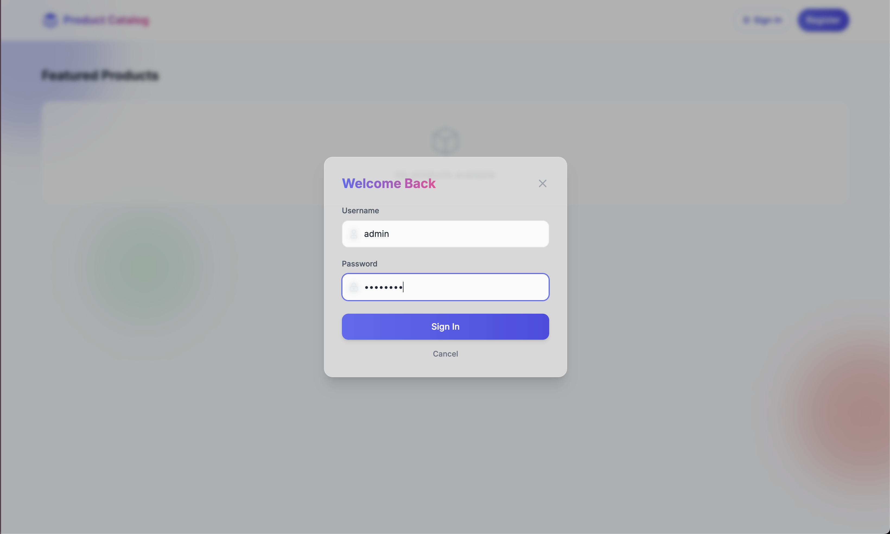

# Modern Product Catalog Application

A full-stack web application for managing and showcasing products with a modern UI, secure authentication, and cloud storage integration. This project was developed as a solution for AmaliTech Training Academy lab assignment.


## Features

### Modern UI with Bento Grid Layout

- Responsive design with modern minimalist aesthetics
- Bento grid layout for featured products
- Glassmorphism effects with blurred backgrounds
- Colorful blob shapes for visual interest
- Pagination for efficient product browsing

### Secure Authentication

- JWT-based authentication with access and refresh tokens
- Automatic token refresh for seamless user experience
- Role-based access control (admin/user roles)
- Secure password hashing with Werkzeug



### Product Management

- Full CRUD operations for products
- Modern image upload interface
- AWS S3 integration for image storage using pre-signed URLs
- Form validation and error handling


### API Documentation

- Swagger UI for API documentation
- Well-documented endpoints for all operations


### Deployment Architecture

- Deployed on AWS EC2 instance
- NGINX reverse proxy with advanced allow/deny rules
- IP-based access control for enhanced security
- Secure configuration for production use


## Technology Stack

### Frontend

- HTML5, CSS3, JavaScript
- Alpine.js for reactive UI components
- Tailwind CSS for styling
- Fetch API for backend communication

### Backend

- Flask (Python) RESTful API
- Flask-JWT-Extended for authentication
- SQLAlchemy for database ORM
- AWS S3 integration for image storage

### Database

- SQLite for development
- PostgreSQL for production

## Project Structure

```
catalog-server/
├── app.py                 # Flask API with JWT auth, RBAC, and CRUD operations
├── catalog.db             # SQLite database
├── requirements.txt       # Python dependencies
├── screenshots/           # Project screenshots
├── test_app.py            # API tests
└── static/                # Frontend files
    ├── index.html         # Main UI built with Tailwind CSS and Alpine.js
    ├── css/               # CSS files (if needed beyond Tailwind)
    ├── img/               # Local image assets
    └── js/
        ├── app.js         # Main application logic
        └── config.js      # Configuration for AWS S3 and API
```

## API Endpoints

### Authentication

- `POST /api/register` - Register a new user
- `POST /api/login` - Login and receive JWT tokens
- `POST /api/refresh` - Refresh access token using refresh token

### Products

- `GET /api/products` - List all products
- `GET /api/products/<id>` - Get a specific product
- `POST /api/products` - Create a new product (authenticated)
- `PUT /api/products/<id>` - Update a product (authenticated)
- `DELETE /api/products/<id>` - Delete a product (authenticated)

### Image Upload

- `GET /api/upload-url` - Get a pre-signed URL for S3 upload (authenticated)

## Security Features

- JWT authentication with short-lived access tokens
- Refresh token mechanism for extended sessions
- Role-based access control
- CORS protection
- Input validation
- Secure password hashing
- AWS signature v4 for secure S3 uploads

## Setting Up

### Backend Setup

1. Create and activate virtual environment:

   ```
   python -m venv venv
   source venv/bin/activate  # On Windows: venv\Scripts\activate
   ```

2. Install dependencies:

   ```
   pip install -r requirements.txt
   ```

3. Run the Flask app:
   ```
   python app.py
   ```

The API will be available at http://localhost:5002, and Swagger docs at http://localhost:5002/apidocs/

### Frontend Setup

#### Development

During development, the static files can be served directly from Flask:

1. Make sure the Flask app is running
2. Visit http://localhost:5002/static/index.html

#### S3 Setup for Production

1. Create or use an existing S3 bucket in your AWS account

2. Configure CORS on your S3 bucket if needed:

   ```json
   [
     {
       "AllowedHeaders": ["*"],
       "AllowedMethods": ["GET", "PUT", "POST"],
       "AllowedOrigins": ["*"],
       "ExposeHeaders": []
     }
   ]
   ```

3. Update `static/js/config.js` with your S3 direct upload URL and bucket URL:

   ```javascript
   const s3Config = {
     // The URL where pre-signed URLs will be obtained
     uploadUrl: "/api/upload-url",

     // Maximum file size in bytes
     maxFileSize: 5 * 1024 * 1024, // 5MB
   };
   ```

## Deployment Architecture

### Overview

This application is deployed on AWS EC2 using a secure architecture with NGINX as a reverse proxy. The architecture implements multiple layers of security through IP-based access control, request filtering, and rate limiting.


### NGINX Configuration

The NGINX reverse proxy serves as the front-facing component, handling all incoming requests before they reach the Flask application. This provides several security benefits:

1. **IP-based Access Control**: Only specified IP ranges can access the application
2. **Request Filtering**: Blocks potentially malicious requests
3. **Rate Limiting**: Prevents DDoS attacks
4. **SSL Termination**: Handles HTTPS encryption/decryption

```nginx
server {
    listen 80;
    server_name _;

    # Redirect HTTP to HTTPS
    return 301 https://$host$request_uri;
}

server {
    listen 443 ssl;
    server_name _;

    # SSL configuration
    ssl_certificate /etc/nginx/ssl/cert.pem;
    ssl_certificate_key /etc/nginx/ssl/key.pem;
    ssl_protocols TLSv1.2 TLSv1.3;
    ssl_prefer_server_ciphers on;

    # Security headers
    add_header Strict-Transport-Security "max-age=31536000; includeSubDomains" always;
    add_header X-Content-Type-Options "nosniff" always;
    add_header X-Frame-Options "SAMEORIGIN" always;
    add_header X-XSS-Protection "1; mode=block" always;

    # Rate limiting zone
    limit_req_zone $binary_remote_addr zone=api_limit:10m rate=5r/s;

    # Static files
    location /static/ {
        alias /var/www/catalog-server/static/;
        expires 30d;
    }

    # API endpoints with rate limiting
    location /api/ {
        limit_req zone=api_limit burst=10 nodelay;
        proxy_pass http://localhost:5002;
        proxy_set_header Host $host;
        proxy_set_header X-Real-IP $remote_addr;

        # IP restriction rules
        allow 192.168.1.0/24;  # Allow internal network
        allow 203.0.113.0/24;  # Allow specific external network
        deny all;              # Deny all other IPs
    }

    # Main application
    location / {
        proxy_pass http://localhost:5002;
        proxy_set_header Host $host;
        proxy_set_header X-Real-IP $remote_addr;
        proxy_set_header X-Forwarded-For $proxy_add_x_forwarded_for;
        proxy_set_header X-Forwarded-Proto $scheme;

        # IP restriction rules - more permissive for frontend
        allow 192.168.0.0/16;  # Allow broader internal network
        allow 203.0.113.0/24;  # Allow specific external network
        allow 198.51.100.0/24; # Allow additional network
        deny all;              # Deny all other IPs
    }

    # Error pages
    error_page 403 /403.html;
    error_page 404 /404.html;
    error_page 500 502 503 504 /50x.html;
}
```

### Security Layers

1. **Network Level**

   - AWS Security Groups restrict traffic to specific ports (80, 443)
   - NGINX IP allow/deny rules provide granular access control

2. **Application Level**

   - JWT authentication with short-lived tokens
   - Role-based access control
   - Input validation and sanitization

3. **Infrastructure**
   - Regular security updates via automated patching
   - Logging and monitoring for suspicious activities

## Default Admin Account

Username: admin  
Password: admin123

```
aws s3 sync static/ s3://your-bucket-name/ --acl public-read
```

5. Access your UI via the S3 website endpoint or CloudFront distribution

## Default Admin User

A default admin user is created on app startup:

- Username: `admin`
- Password: `admin123`

## API Endpoints

| Endpoint             | Method | Description          | Auth Required |
| -------------------- | ------ | -------------------- | ------------- |
| `/api/register`      | POST   | Register new user    | No            |
| `/api/login`         | POST   | Login and get tokens | No            |
| `/api/products`      | GET    | List all products    | Optional      |
| `/api/products/<id>` | GET    | Get product details  | Optional      |
| `/api/products`      | POST   | Create new product   | Yes           |
| `/api/products/<id>` | PUT    | Update product       | Yes           |
| `/api/products/<id>` | DELETE | Delete product       | Yes           |

## Security Considerations

For production use:

1. Store AWS credentials securely (not in frontend code)
2. Use AWS Cognito or similar for temporary credentials
3. Enable HTTPS on your API
4. Set specific CORS origins instead of wildcard "\*"
5. Implement token refresh
6. Change default admin credentials
